# [Chest X-ray (Covid-19 & Pneumonia)](https://www.kaggle.com/prashant268/chest-xray-covid19-pneumonia/)
COVID-19 (coronavirus disease 2019) is an infectious disease caused by severe acute respiratory syndrome coronavirus 2 (SARS-CoV-2), a strain of coronavirus. The first cases were seen in Wuhan, China, in late December 2019 before spreading globally. The current outbreak was officially recognized as a pandemic by the World Health Organization (WHO) on 11 March 2020. Currently Reverse transcription polymerase chain reaction (RT-PCR) is used for diagnosis of the COVID-19. X-ray machines are widely available and provide images for diagnosis quickly so chest X-ray images can be very useful in early diagnosis of COVID-19.
In this classification project, there are three classes:
- COVID19
- PNEUMONIA
- NORMAL


## Contents: 
- Data description
- Data scaling, normalization and augmentation 
- Training Tips
- Understanding Results through visualization
- Transfer Learning
- Ensemble Learning
- Next Steps

## 1) Data description
Dataset is organized into 2 folders (train, test) and both train and test contain 3 subfolders (COVID19, PNEUMONIA, NORMAL) one for each class. DataSet contains total 6432 x-ray images and test data have 20% of total images. As a start, it is very important to inspect the data across the three classes:

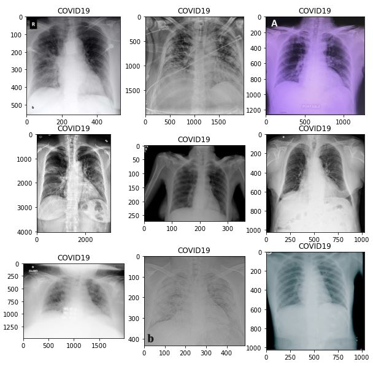
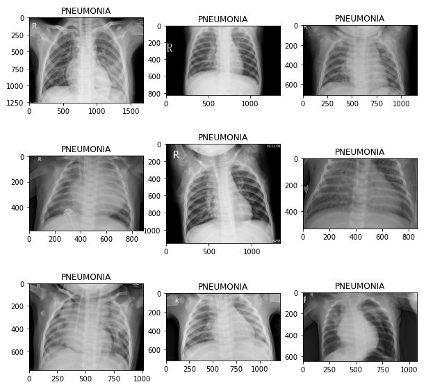


It is clear that images are at **different sizes**. 


## 2) Data scaling, normalization and augmentation 
Based on data inspection, images are scaled to a size of 244 by 244, normalized to values (0,1) and augmented by simple zoom and rotation to enhance the generalization.    

```
image_size = 224 
BATCH_SIZE = 16 

data_path = '/kaggle/input/chest-xray-covid19-pneumonia/Data'

train_datagen = ImageDataGenerator(rescale = 1./255,
                                   zoom_range = 0.2,
                                   rotation_range=15,
                                   horizontal_flip = True)

test_datagen = ImageDataGenerator(rescale = 1./255)

training_set = train_datagen.flow_from_directory(data_path + '/train',
                                                 target_size = (image_size, image_size),
                                                 batch_size = BATCH_SIZE,
                                                 class_mode = 'categorical',
                                                 shuffle=True)

testing_set = test_datagen.flow_from_directory(data_path + '/test',
                                            target_size = (image_size, image_size),
                                            batch_size = BATCH_SIZE,
                                            class_mode = 'categorical',
                                            shuffle = True)

```

Accordingly, the dataset shape is as follows: 

```
print("train batch ", training_set.__getitem__(0)[0].shape)
print("test batch ", testing_set.__getitem__(0)[0].shape)
print("sample train label \n", training_set.__getitem__(0)[1][:5])
```

- train batch  (16, 224, 224, 3)
- test batch  (16, 224, 224, 3)
- sample train label 
 [[0. 0. 1.]
 [0. 1. 0.]
 [0. 1. 0.]
 [1. 0. 0.]
 [0. 0. 1.]]


It is also important to understand the one-hot-encoding

```
training_set.class_indices
```
- {'COVID19': 0, 'NORMAL': 1, 'PNEUMONIA': 2}

Testset sample after data preparation:

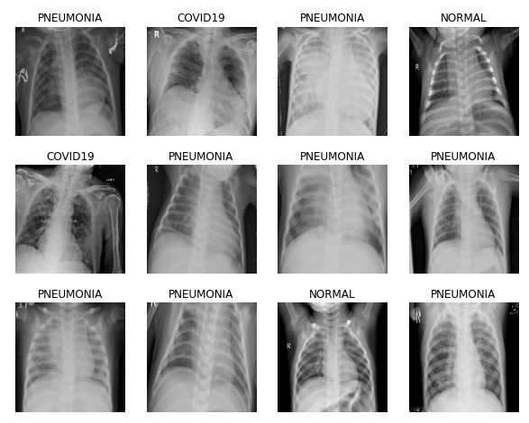

## 3) Training Tips

### Callbacks
It is usually important to use callbacks while training. For example:
- ReduceLROnPlateau: Reduce learning rate when a metric has stopped improving
- EarlyStopping: Stop training when a monitored metric has stopped improving

```
lr_reduce = tf.keras.callbacks.ReduceLROnPlateau(monitor='val_loss', factor=0.5, epsilon=0.0001, patience=3, verbose=1)
es_callback = tf.keras.callbacks.EarlyStopping(monitor='val_loss', patience=5, verbose=1)
```

### Label smoothing
[Label smoothing](https://www.linkedin.com/pulse/label-smoothing-solving-overfitting-overconfidence-code-sobh-phd/) is a mechanism for encouraging the model to be less confident. Instead of minimizing cross-entropy with hard targets (one-hot encoding), we minimize it using soft targets, this usually leads to a better generalization.

```
def categorical_smooth_loss(y_true, y_pred, label_smoothing=0.1):
    loss = tf.keras.losses.categorical_crossentropy(y_true, y_pred, label_smoothing=label_smoothing)
    return loss
```

### Imbalanced data 

In the case where data is (number of samples of some class is much more another class), different methods can be applied. **Class weight** is a simple method that can be used  to specify sample weights when fitting the classifiers. For example, in the training data it is found that:
- NORMAL: 1266
- PNEUMONIA: 3418
- COVID19: 460

Accoringly, class weights can be applied:   

```
counter = Counter(training_set.classes)                          
max_val = float(max(counter.values()))       
class_weights = {class_id : max_val/num_images for class_id, num_images in counter.items()}

model.fit_generator(..., class_weight=class_weights)
```

Note: class weight is not used in the following experiments.

## 4) Understanding Results through visualization  

**Class Activation Map (CAM)** visualization techniques produce heatmaps of 2D class activation over input images, showing how important each location is for the considered class. In the paper [Grad-CAM: Why did you say that? Visual Explanations from Deep Networks via Gradient-based Localization](https://arxiv.org/abs/1610.02391), the visualization is conducted by taking the output feature map of a convolution layer (given an input image), and then weighing every channel (feature map) by the gradient of the output class wrt the feature map.

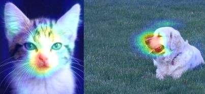

For example, the last CNN layer of some trained network has shape of 7 x 7 x n. Accordingly, we can find the corresponding **7 x 7 heatmap** and generate the final result as shown below for the COVID19 test sample located at /test/COVID19/COVID19(164).jpg

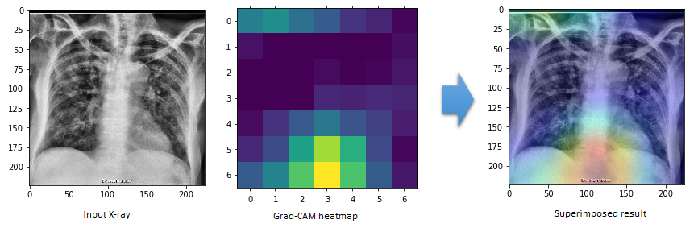


## 5) Transfer Learning

Instead of starting from scratch, **Transfer Learning** is used by loading a generic and well trained image classification network for feature extraction, and then adding few layers (head) to be trained for the target task. Three pretrained networks are used: 

- [DenseNet](https://arxiv.org/abs/1608.06993)
- [EfficientNetB7](https://arxiv.org/abs/1905.11946)
- [VGG16](https://arxiv.org/abs/1409.1556)

Steps: 
- The pretrained network is loaded without the final classifcation head.
- Freeze the weights of the pretrained network.
- Add new head layers to be trained.

### DenseNet201 Transfer Learning

```
pretrained_densenet = tf.keras.applications.DenseNet201(input_shape=(image_size, image_size, 3), weights='imagenet', include_top=False)

for layer in pretrained_densenet.layers:
  layer.trainable = False

x1 = pretrained_densenet.output
x1 = tf.keras.layers.AveragePooling2D(name="averagepooling2d_head")(x1)
x1 = tf.keras.layers.Flatten(name="flatten_head")(x1)
x1 = tf.keras.layers.Dense(64, activation="relu", name="dense_head")(x1)
x1 = tf.keras.layers.Dropout(0.5, name="dropout_head")(x1)
model_out = tf.keras.layers.Dense(3, activation='softmax', name="predictions_head")(x1)

model_densenet = Model(inputs=pretrained_densenet.input, outputs=model_out)
model_densenet.compile(optimizer=tf.keras.optimizers.Adam(learning_rate=0.0001),loss=categorical_smooth_loss,metrics=['accuracy'])
model_densenet.summary()
```
- Trainable params: **1,106,179**

```
history_densenet = model_densenet.fit_generator(training_set, validation_data=testing_set, callbacks=[lr_reduce, es_callback], epochs=30) 
```

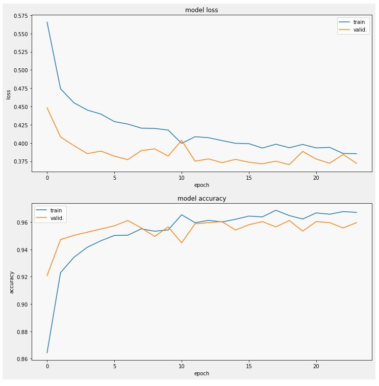


- val_accuracy: **0.9596** (very good as a start indeed)

Sampe test results:

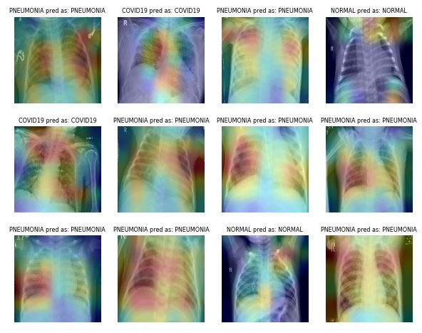


### EfficientNetB7 Transfer Learning

```
pretrained_efnet = efn.EfficientNetB7(input_shape=(image_size, image_size, 3), weights='noisy-student', include_top=False)

for layer in pretrained_efnet.layers:
  layer.trainable = False

x2 = pretrained_efnet.output
x2 = tf.keras.layers.AveragePooling2D(name="averagepooling2d_head")(x2)
x2 = tf.keras.layers.Flatten(name="flatten_head")(x2)
x2 = tf.keras.layers.Dense(64, activation="relu", name="dense_head")(x2)
x2 = tf.keras.layers.Dropout(0.5, name="dropout_head")(x2)
model_out = tf.keras.layers.Dense(3, activation='softmax', name="predictions_head")(x2)

model_efnet = Model(inputs=pretrained_efnet.input, outputs=model_out)
model_efnet.compile(optimizer=tf.keras.optimizers.Adam(learning_rate=0.0001),loss=categorical_smooth_loss,metrics=['accuracy'])
model_efnet.summary()
```

- Trainable params: **1,474,819**

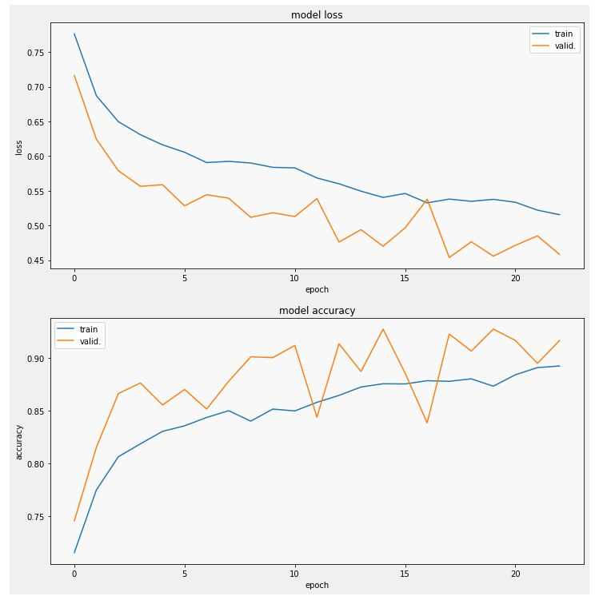


- val_accuracy: **0.9169**

Sampe test results:

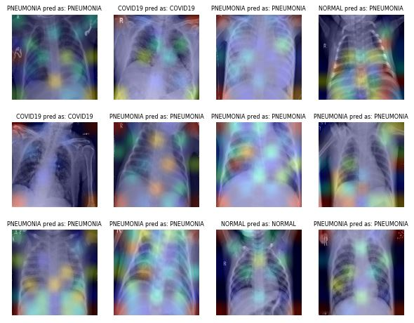

Note that the defualt image size for the EfficientNetB7 is 600 by 600

### VGG16 Transfer Learning

```
pretrained_vgg = tf.keras.applications.VGG16(input_shape=(image_size, image_size, 3), weights='imagenet', include_top=False)

for layer in pretrained_vgg.layers:
  layer.trainable = False

x3 = pretrained_vgg.output
x3 = tf.keras.layers.AveragePooling2D(name="averagepooling2d_head")(x3)
x3 = tf.keras.layers.Flatten(name="flatten_head")(x3)
x3 = tf.keras.layers.Dense(128, activation="relu", name="dense_head")(x3)
x3 = tf.keras.layers.Dropout(0.5, name="dropout_head")(x3)
x3 = tf.keras.layers.Dense(64, activation="relu", name="dense_head_2")(x3)
x3 = tf.keras.layers.Dropout(0.5, name="dropout_head_2")(x3)
model_out = tf.keras.layers.Dense(3, activation='softmax', name="predictions_head")(x3)

model_vgg = Model(inputs=pretrained_vgg.input, outputs=model_out)
model_vgg.compile(optimizer=tf.keras.optimizers.Adam(learning_rate=0.0001),loss=categorical_smooth_loss,metrics=['accuracy'])
# model_vgg.compile(optimizer=tf.keras.optimizers.Adam(learning_rate=0.0001),loss="categorical_crossentropy",metrics=['accuracy'])
model_vgg.summary()
```

- Trainable params: **598,403**

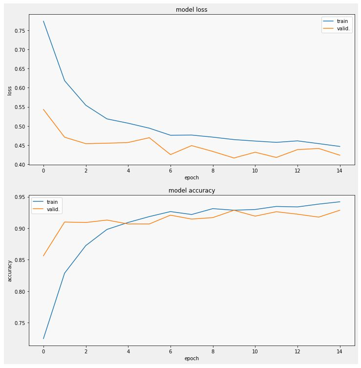


- val_accuracy: **0.9286**

Sampe test results:

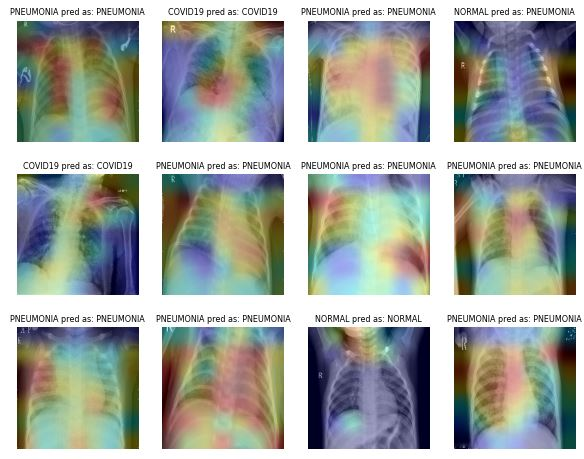


## 6) Ensemble Learning 

In Ensemble learning, multiple models, such as classifiers, are combined together to improve the performance.

### Ensemble at the probability level

In this setup, the network tries to find a combination of the final probs to come up with a better model. This is not the best way, but very simple where we have only **30** trainable parameters.

```
for layer in model_densenet.layers:
  layer.trainable = False

for layer in model_efnet.layers:
  layer.trainable = False

for layer in model_vgg.layers:
  layer.trainable = False

visible = tf.keras.layers.Input(shape=(image_size, image_size, 3), name="input")
x1 = model_densenet(visible)
x2 = model_efnet(visible)
x3 = model_vgg(visible)
merge = tf.keras.layers.concatenate([x1, x2, x3], name="concatallprobs")
model_out = tf.keras.layers.Dense(3, activation='softmax', name="predictions")(merge)

model_densenet_efnet_vgg = Model(inputs=visible, outputs=model_out)
model_densenet_efnet_vgg.compile(optimizer=tf.keras.optimizers.Adam(learning_rate=0.0001),loss='categorical_crossentropy',metrics=['accuracy'])
model_densenet_efnet_vgg.summary()
```

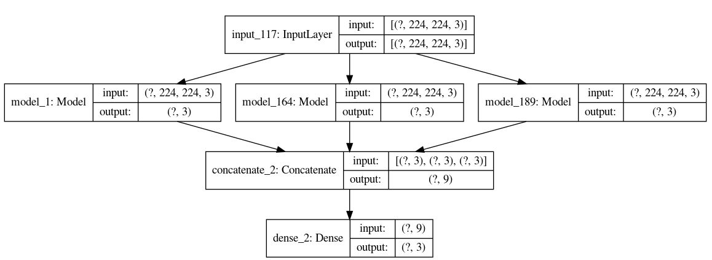

### Ensemble at the last dense layer

This setup gives the network a better chance to learn from the dense layers before the softmax using only **579** trainable parameters.

```
model_densenet_nohead = Model(inputs=model_densenet.input, outputs=model_densenet.get_layer("dense_head").output)
model_efnet_nohead = Model(inputs=model_efnet.input, outputs=model_efnet.get_layer("dense_head").output)
model_vgg_nohead = Model(inputs=model_vgg.input, outputs=model_vgg.get_layer("dense_head_2").output)

for layer in model_densenet_nohead.layers:
  layer.trainable = False

for layer in model_efnet_nohead.layers:
  layer.trainable = False

for layer in model_vgg_nohead.layers:
  layer.trainable = False

visible = tf.keras.layers.Input(shape=(image_size, image_size, 3), name="input")
x1 = model_densenet_nohead(visible)
x2 = model_efnet_nohead(visible)
x3 = model_vgg_nohead(visible)
merge = tf.keras.layers.concatenate([x1, x2, x3], name="concatallprobs")
model_out = tf.keras.layers.Dense(3, activation='softmax', name="predictions")(merge)

model_densenet_efnet_vgg_nohead = Model(inputs=visible, outputs=model_out)
model_densenet_efnet_vgg_nohead.compile(optimizer=tf.keras.optimizers.Adam(learning_rate=0.001),loss='categorical_crossentropy',metrics=['accuracy']) #categorical_smooth_loss
model_densenet_efnet_vgg_nohead.summary()
```

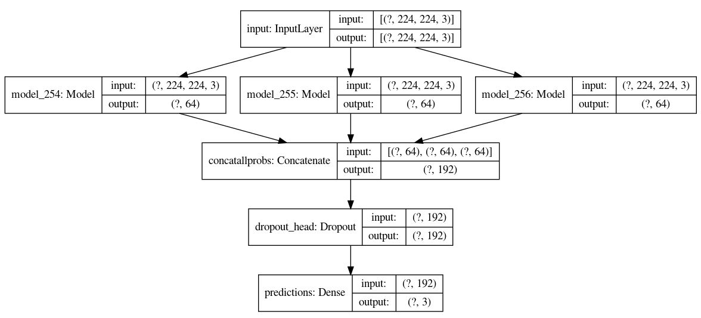

In this setup the final results are marginally better than any of the three models (there is still a room for enhancement)


## Code
The full code can be found on [Kaggle](https://www.kaggle.com/ibrahimsobh/chest-x-ray-covid19-efnet-densenet-vgg-grad-cam/)

# 7) Next Steps:
- Use more versions of DenseNet EfficientNet 
- Use other nets such as MobileNet
- Apply fine-tuning on some layers 
- Apply more reasonable data augmentation
- Try Focal Loss with different settings
- Consider that the cost of misclassification of normal as covid19 is not the same as misclassification of covid19 as normal
